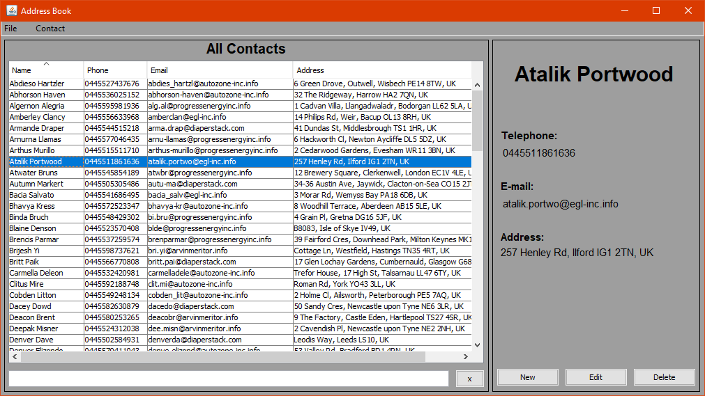

# Address book – desktop application
## Description
> This desktop application was developed using Java and the Swing library for graphic user interfaces, the main purpose of developing this project was to apply the event-driven programming paradigm.
This application is an address book in which we can create, read, update and delete contacts, and their information is stored on a text file which can be used to persist that information, by default an existing file with multiple contacts is already included on this project.
## Technologies used:
* Java
* Swing
## Screenshot
